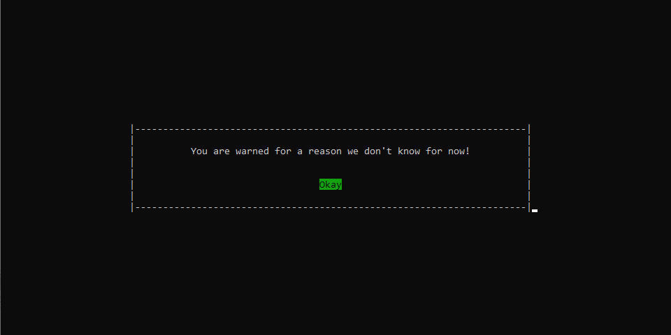
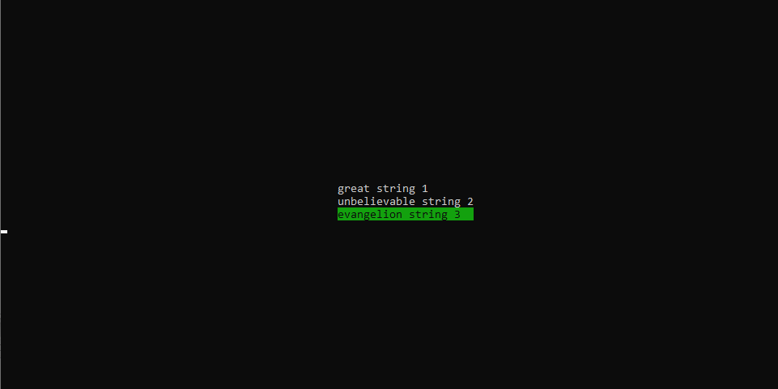

# c-terminal-gui
### Easy and more beautiful way to get input and give input by using prompt windows at C terminal

Main.c provides an example way to use my library.
Main idea of this project is to eliminate need for using gotoxy function, make it easier to use simple and beautiful GUI inside terminal and allow developers to focus on main thing they are developing.

Example Pictures:

