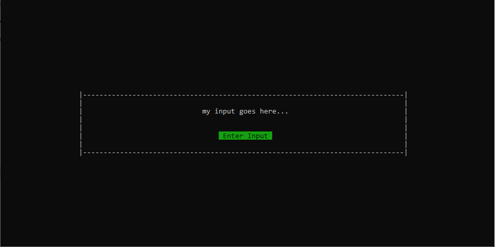
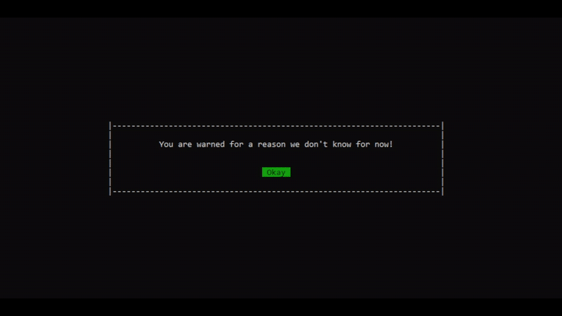

# c-terminal-gui
Main.c provides an example way to use my library. Please ⭐ star it if you found it useful!<br>
Main idea of this project is to eliminate need for using gotoxy function, make it easier to use beautiful GUI inside terminal and allow developers to focus on main thing.You can hide cursor(blinking underscore) too!
#### Example Pictures:





#### Usage

##### Selection Prompt

SelectionPrompt function takes an 2d dimensional C char array. First dimension length can change but second dimension length must be 500. Visually it doesn't change anything, it is about how C reserves memory. You can give anything and SelectionPrompt function will handle making string lengths equal, rendering them at center of the terminal, handling user key presses(arrow up, arrow down and enter key).

After user selects an option, SelectionPrompt will return the index number of that selection.

Second argument of the SelectionPrompt must be row length of the two dimensional char array you are passing to the function. This is because when you don't limit the row length of a two dimensional array, C cannot know the length of that array AFTER you pass it down to a function.

```C
// You should use string length of 500. Visually it doesn't change anything.
char exampleStrings[3][500] = {"great string 1","unbelievable string 2","evangelion string 3"};

int index = SelectionPrompt(exampleStrings, sizeof(exampleStrings)/sizeof(exampleStrings[0]));

printf("You selected this:%s!\nPress Enter to Continue...\n", exampleStrings[index]);
```

##### Warning Prompt

First argument takes an char array(string) and second argument takes the length of it. You can see main.c for usage example. This function returns nothing. It warns user with the text provided and automatically renders at the center of the terminal and handles the box size accordingly. It closes when user presses the ENTER key.

```C
char helloString[] = "You are warned for a reason we don't know for now!";

WarningPrompt(helloString, sizeof(helloString));
```

##### Input Prompt

Has no arguments and returns a char pointer(string). It allows users to enter input with a prompt box. Usage is extremely easy, only 1 function.

```C
printf("You entered this input: %s", InputPrompt());
```

##### WaitUntilEnterPressed

Blocking function to wait until user presses the enter key. It is useful to wait and ensure that user reads your data before a prompt cleans the screen.

```C
WaitUntilEnterPressed();
```

##### HideCursor

Calling this function hides the blinking underscore so that updates of the cursor position won't annoy the user.(since we use gotoxy, it is unavoidable to not change cursor position.)<br>
Use it on top of your main function. Use it only once.

```C
HideCursor();
```

##### Example Program

For a working example, please build and run main.c